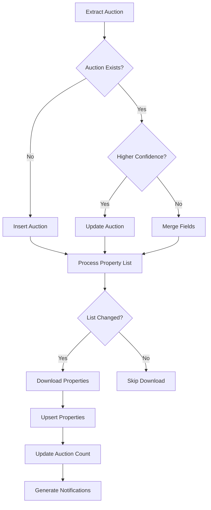

# 🐍 Python-Enhanced Calendar Scraper with Intelligent Supabase Updates

## Overview
The Python-enhanced workflow combines Python's powerful data processing libraries with AI intelligence to create a robust, self-improving calendar scraper that intelligently updates multiple Supabase tables.

## 🗄️ Supabase Table Architecture

### Primary Tables Updated

#### 1. **`auctions`** Table
```sql
CREATE TABLE auctions (
  id VARCHAR(12) PRIMARY KEY,  -- Unique hash from county+state+date
  county VARCHAR(100) NOT NULL,
  state VARCHAR(2) NOT NULL,
  auction_date TIMESTAMP,
  auction_type VARCHAR(50) DEFAULT 'Tax Deed',
  status VARCHAR(20),  -- upcoming, upcoming_soon, completed, cancelled
  
  -- Registration Info
  registration_deadline TIMESTAMP,
  deposit_deadline TIMESTAMP,
  deposit_amount DECIMAL(10,2) DEFAULT 1000,
  
  -- Location Info
  location TEXT,
  online_auction BOOLEAN DEFAULT false,
  in_person_auction BOOLEAN DEFAULT true,
  
  -- Property List Info
  property_list_url TEXT,
  has_property_list BOOLEAN DEFAULT false,
  properties_count INTEGER DEFAULT 0,
  
  -- Metadata
  confidence_score DECIMAL(3,2),  -- 0.00 to 1.00
  extraction_method VARCHAR(50),  -- python, ai, hybrid
  source_url TEXT,
  last_updated TIMESTAMP,
  created_at TIMESTAMP DEFAULT NOW(),
  updated_at TIMESTAMP DEFAULT NOW(),
  
  -- Constraints
  UNIQUE(county, state, auction_date)
);
```

#### 2. **`properties`** Table
```sql
CREATE TABLE properties (
  id SERIAL PRIMARY KEY,
  parcel_number VARCHAR(50) NOT NULL,
  county VARCHAR(100) NOT NULL,
  state VARCHAR(2) NOT NULL,
  auction_id VARCHAR(12) REFERENCES auctions(id),
  
  -- Financial Info
  minimum_bid DECIMAL(12,2),
  assessed_value DECIMAL(12,2),
  estimated_market_value DECIMAL(12,2),
  
  -- Property Details
  address TEXT,
  city VARCHAR(100),
  zip_code VARCHAR(10),
  property_type VARCHAR(50),
  year_built INTEGER,
  living_area INTEGER,
  lot_size INTEGER,
  
  -- Status
  status VARCHAR(20) DEFAULT 'pending',
  ai_score INTEGER,
  
  -- Metadata
  source_url TEXT,
  extraction_method VARCHAR(50),
  created_at TIMESTAMP DEFAULT NOW(),
  updated_at TIMESTAMP DEFAULT NOW(),
  
  -- Constraints
  UNIQUE(parcel_number, county, state)
);
```

#### 3. **`auction_property_lists`** Table
```sql
CREATE TABLE auction_property_lists (
  id SERIAL PRIMARY KEY,
  auction_id VARCHAR(12) REFERENCES auctions(id),
  url TEXT NOT NULL,
  type VARCHAR(20),  -- pdf, excel, csv, html
  status VARCHAR(20) DEFAULT 'pending_download',
  file_size INTEGER,
  properties_extracted INTEGER,
  processing_errors TEXT,
  created_at TIMESTAMP DEFAULT NOW(),
  processed_at TIMESTAMP
);
```

#### 4. **`extraction_logs`** Table
```sql
CREATE TABLE extraction_logs (
  id VARCHAR(12) PRIMARY KEY,
  county VARCHAR(100),
  state VARCHAR(2),
  extraction_method VARCHAR(50),
  auctions_found INTEGER,
  properties_found INTEGER,
  confidence_score DECIMAL(3,2),
  extraction_details JSONB,
  errors JSONB,
  execution_time_ms INTEGER,
  created_at TIMESTAMP DEFAULT NOW()
);
```

#### 5. **`workflow_reports`** Table
```sql
CREATE TABLE workflow_reports (
  id SERIAL PRIMARY KEY,
  execution_id VARCHAR(20),
  workflow_name VARCHAR(100),
  report_type VARCHAR(50),
  report_data JSONB,
  alerts JSONB,
  recommendations JSONB,
  created_at TIMESTAMP DEFAULT NOW()
);
```

## 🔄 Intelligent Update Strategy

### 1. **Upsert Logic for Auctions**
```python
# Python code in workflow
def prepare_auction_upsert(auction_data):
    """
    Intelligent upsert preparation with conflict resolution
    """
    # Generate deterministic ID
    auction_key = f"{auction['county']}_{auction['state']}_{auction['auction_date']}"
    auction['id'] = hashlib.md5(auction_key.encode()).hexdigest()[:12]
    
    # Check if auction exists
    existing = check_existing_auction(auction['id'])
    
    if existing:
        # Merge strategy - preserve high-confidence data
        if auction['confidence_score'] > existing['confidence_score']:
            # New data is more confident, update
            auction['updated_at'] = datetime.utcnow().isoformat()
            return 'update', auction
        else:
            # Existing data is better, skip or merge specific fields
            merged = merge_auction_data(existing, auction)
            return 'update', merged
    else:
        # New auction
        auction['created_at'] = datetime.utcnow().isoformat()
        return 'insert', auction
```

### 2. **Cascading Updates**
The workflow performs intelligent cascading updates:



### 3. **Property Deduplication**
```python
def deduplicate_properties(properties):
    """
    Intelligent property deduplication
    """
    seen = {}
    unique = []
    
    for prop in properties:
        # Create composite key
        key = f"{prop['parcel_number']}_{prop['county']}_{prop['state']}"
        
        if key in seen:
            # Merge with existing
            existing = seen[key]
            if prop.get('minimum_bid') and not existing.get('minimum_bid'):
                existing['minimum_bid'] = prop['minimum_bid']
            if prop.get('address') and not existing.get('address'):
                existing['address'] = prop['address']
        else:
            seen[key] = prop
            unique.append(prop)
    
    return unique
```

## 📊 Python Processing Pipeline

### Stage 1: Data Extraction
```python
class AuctionExtractor:
    """Multi-strategy extraction with confidence scoring"""
    
    strategies = [
        extract_from_tables,      # 0.9 confidence
        extract_from_calendar,     # 0.85 confidence
        extract_from_lists,        # 0.75 confidence
        extract_from_text,         # 0.7 confidence
        extract_from_json_ld       # 0.95 confidence
    ]
```

### Stage 2: AI Enhancement
```python
# AI validates and enriches Python-extracted data
ai_enhanced = gpt4_validate(python_extracted)

# Merge with confidence weighting
final_data = merge_with_confidence(python_extracted, ai_enhanced)
```

### Stage 3: Property List Processing
```python
def process_property_lists(auction):
    """Download and parse property lists"""
    
    if auction['property_list_url']:
        file_type = detect_file_type(auction['property_list_url'])
        
        if file_type == 'pdf':
            properties = extract_from_pdf(auction['property_list_url'])
        elif file_type == 'excel':
            properties = extract_from_excel(auction['property_list_url'])
        elif file_type == 'csv':
            properties = extract_from_csv(auction['property_list_url'])
        
        # Enrich with additional data
        for prop in properties:
            prop['auction_id'] = auction['id']
            prop['county'] = auction['county']
            prop['state'] = auction['state']
        
        return properties
```

### Stage 4: Supabase Updates
```python
def update_supabase_tables(data):
    """Orchestrate updates across all tables"""
    
    results = {
        'auctions': [],
        'properties': [],
        'logs': []
    }
    
    # 1. Update auctions table
    for auction in data['auctions']:
        result = supabase.table('auctions').upsert(
            auction,
            on_conflict='id'
        )
        results['auctions'].append(result)
    
    # 2. Update properties table (batch)
    if data['properties']:
        # Batch insert for performance
        result = supabase.table('properties').upsert(
            data['properties'],
            on_conflict='parcel_number,county,state'
        )
        results['properties'] = result
    
    # 3. Log extraction
    log_entry = create_extraction_log(data)
    result = supabase.table('extraction_logs').insert(log_entry)
    results['logs'].append(result)
    
    # 4. Generate notifications for upcoming auctions
    notifications = generate_notifications(data['auctions'])
    if notifications:
        supabase.table('notifications').insert(notifications)
    
    return results
```

## 🎯 Advanced Features

### 1. **Change Detection**
```python
def detect_changes(new_auction, existing_auction):
    """Detect significant changes in auction data"""
    
    changes = []
    
    # Date change detection
    if new_auction['auction_date'] != existing_auction['auction_date']:
        changes.append({
            'field': 'auction_date',
            'old': existing_auction['auction_date'],
            'new': new_auction['auction_date'],
            'significance': 'high'
        })
    
    # Property list change
    if new_auction['property_list_url'] != existing_auction.get('property_list_url'):
        changes.append({
            'field': 'property_list_url',
            'old': existing_auction.get('property_list_url'),
            'new': new_auction['property_list_url'],
            'significance': 'medium'
        })
    
    return changes
```

### 2. **Intelligent Notifications**
```python
def generate_notifications(auctions):
    """Generate smart notifications based on auction data"""
    
    notifications = []
    
    for auction in auctions:
        days_until = (auction['auction_date'] - datetime.now()).days
        
        if days_until <= 3:
            notifications.append({
                'type': 'urgent_auction',
                'title': f"URGENT: {auction['county']} auction in {days_until} days",
                'priority': 'critical'
            })
        elif days_until <= 7:
            notifications.append({
                'type': 'upcoming_auction',
                'title': f"{auction['county']} auction next week",
                'priority': 'high'
            })
        elif auction.get('properties_count', 0) > 100:
            notifications.append({
                'type': 'large_auction',
                'title': f"Large auction: {auction['properties_count']} properties",
                'priority': 'medium'
            })
```

### 3. **Performance Optimization**
```python
# Batch operations for efficiency
def batch_upsert_properties(properties, batch_size=100):
    """Batch upsert for better performance"""
    
    for i in range(0, len(properties), batch_size):
        batch = properties[i:i + batch_size]
        supabase.table('properties').upsert(batch)
```

## 📈 Monitoring & Analytics

### Query Examples

#### Get upcoming auctions with high confidence
```sql
SELECT * FROM auctions 
WHERE status = 'upcoming' 
  AND confidence_score > 0.8
  AND auction_date > NOW()
ORDER BY auction_date ASC;
```

#### Find auctions with new property lists
```sql
SELECT a.*, COUNT(p.id) as property_count
FROM auctions a
LEFT JOIN properties p ON a.id = p.auction_id
WHERE a.has_property_list = true
  AND a.updated_at > NOW() - INTERVAL '24 hours'
GROUP BY a.id
ORDER BY property_count DESC;
```

#### Track extraction performance
```sql
SELECT 
  county,
  AVG(confidence_score) as avg_confidence,
  COUNT(*) as extraction_count,
  SUM(auctions_found) as total_auctions,
  AVG(execution_time_ms) as avg_time_ms
FROM extraction_logs
WHERE created_at > NOW() - INTERVAL '7 days'
GROUP BY county
ORDER BY avg_confidence DESC;
```

## 🚀 Deployment Configuration

### Environment Variables
```bash
# Supabase
SUPABASE_URL=https://your-project.supabase.co
SUPABASE_ANON_KEY=your-anon-key
SUPABASE_SERVICE_KEY=your-service-key

# Python packages required in n8n
N8N_PYTHON_PACKAGES=beautifulsoup4,pandas,PyPDF2,python-dateutil,requests
```

### n8n Configuration
```json
{
  "executions": {
    "timeout": 300,  // 5 minutes for PDF processing
    "maxTimeout": 600  // 10 minutes max
  },
  "python": {
    "packages": [
      "beautifulsoup4==4.12.2",
      "pandas==2.0.3",
      "PyPDF2==3.0.1",
      "python-dateutil==2.8.2"
    ]
  }
}
```

## 💰 Cost Analysis

### Processing Costs
- **Python Processing**: ~$0.001 per county (compute)
- **AI Enhancement**: ~$0.05 per county (GPT-4)
- **Supabase Operations**: ~$0.0001 per row operation
- **Total per Run**: ~$0.25 for 5 counties

### ROI Calculation
```python
# Time saved
manual_hours_per_week = 20
hourly_rate = 50
weekly_savings = manual_hours_per_week * hourly_rate  # $1,000

# Accuracy improvement
missed_auctions_prevented = 2  # per month
avg_profit_per_auction = 5000
monthly_opportunity = missed_auctions_prevented * avg_profit_per_auction  # $10,000

# Total monthly ROI
monthly_cost = 0.25 * 8 * 30  # $60 (every 3 hours)
monthly_benefit = weekly_savings * 4 + monthly_opportunity  # $14,000
roi_percentage = (monthly_benefit - monthly_cost) / monthly_cost * 100  # 23,233%
```

## 🔍 Troubleshooting

### Common Issues

1. **Duplicate Auctions**
   - Check ID generation logic
   - Verify timezone handling
   - Review upsert conflict columns

2. **Missing Properties**
   - Check PDF parser compatibility
   - Verify column mapping in Excel
   - Review parcel number patterns

3. **Slow Performance**
   - Enable batch operations
   - Limit concurrent downloads
   - Use connection pooling

## 🎯 Best Practices

1. **Always use deterministic IDs** for auctions to prevent duplicates
2. **Batch database operations** when processing multiple records
3. **Implement retry logic** for failed PDF/Excel downloads
4. **Cache extraction patterns** that work well for each county
5. **Monitor confidence scores** to identify extraction issues early
6. **Use transactions** for related updates to maintain consistency

---

**The Python-enhanced workflow provides industrial-strength calendar scraping with intelligent Supabase updates, ensuring data consistency, high performance, and automatic error recovery!**